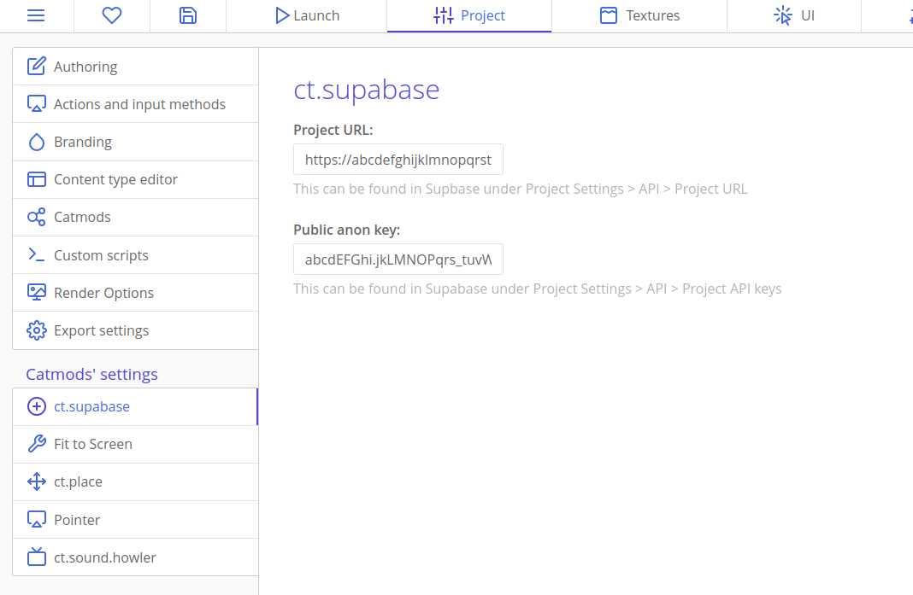
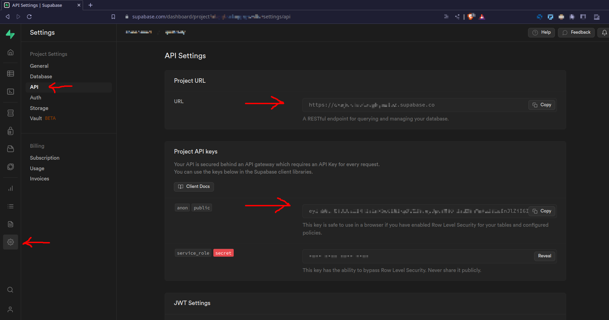

# ct.supabase

ct.supabase is a ct.js module/catmod for games using [supabase](https://supabase.com).

Supabase is an open source platform with database, authentication, realtime, storage, and other APIs. Supabase is great for games that save users progress to the cloud, have user accounts, or have multiplayer functionality.

## How this catmod works

This catmod doesn't add any extra functionality to supabase's javascript library, so you can read [supabase's docs](https://supabase.com/docs) and use all of their examples, but replace `supabase.example()` with `ct.supabase.example()`

This catmod already "installs" and initalizes supabase, so in [supabase's javascript reference](https://supabase.com/docs/reference/javascript), you can skip the `Installing` and `Initalizing` sections.

## Setup

In ct.js, go to Project > Catmod's settings > ct.supabase

You need to enter your Supabase URL and Public anon key to be able to use ct.supabase.

These can be found in supabase, under Project Settings > API

Copy the URL and Public anon key and paste it into ct.js, of of these are public, so it is NOT a security risk to have them visible in your game's code.

After this, you can use all of supabase's javascript library, as described in their documentation. Remember to use `ct.supabase.example()` instead of `supabase.example()`.
