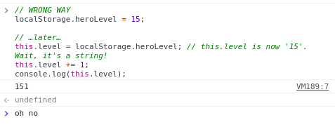

# Saving and Loading Games with LocalStorage

Saving a game's state is a necessary feature for games with anyhow long-term progression. Maybe you also want to store a highscore and a nickname for a fast-paced game with short playsessions. LocalStorage to the rescue! This global object allows for storing different string values and accessing them later. This feature works both in modern browsers and packed games. Combined with other handy features, we can store nearly any type of data!

## Saving Simple Values

Saving and reading string values is pretty easy:

```js
// Writing values to localStorage
localStorage.heroName = 'Isaac Newcat';
localStorage.heroTitle = 'The Allmighty';

// Reading values back
if ('heroName' in localStorage) { // was anything saved before?
    // Read the values
    this.name = localStorage.heroName;
    this.title = localStorage.heroTitle;
} else {
    // Do something with a missing data
    requestNameAndTitle();
}
```

When it comes to numbers, dates, booleans, other stuff, we need to convert read values before using them.

```js
// WRONG WAY
localStorage.heroLevel = 15;

// …later…
this.level = localStorage.heroLevel;
// this.level is now '15'. Wait, it's a string!
this.level += 1;
console.log(this.level);
```



`this.level` is now `'151'`! This is definitely not what we would expect. The reason is that `localStorage` can only store things, and anything else is turned into those. Because of that, we need to convert the values of `localStorage` to the needed types.

```js
// BETTER WAY
localStorage.heroLevel = 15;
// …later…
this.level = Number(localStorage.heroLevel);
// this.level is now 15. It's a number!
this.level += 1;
console.log(this.level);
```


Here is how we can convert Date objects and Booleans:

```js
localStorage.gameStartTime = new Date();
localStorage.hardcoreMode = false;

// later…

this.startTime = new Date(localStorage.gameStartTime);
this.hardcoreMode = localStorage.hardcoreMode === 'true';
```

## Storing Complex Objects

For anything beyound simple strings and numbers we need special encoding and decoding functions. Thankfully, there is such functions in JavaScript! They are `JSON.parse(encodedString)` and `JSON.stringify(complexObject)`.

```js
var inventory = [{
    name: 'A rusty axe',
    type: 'weapon',
    twoHanded: true
    durability: 0.87,
    damage: [8, 11],
    effects: {
        poison: 1,
        duration: 5
    },
    icon: 'BattleAxe_Old'
    stack: 1
}, {
    name: 'Health Potion',
    type: 'consumable',
    effects: {
        regen: 5,
        duration: 15
    },
    icon: 'Potion_Red',
    stack: 15
}, {
    // …other stuff
}];

localStorage.heroInventory = JSON.stringify(inventory);

// …later

this.inventory = JSON.parse(localStorage.heroInventory);
```

This is quite a complex thing! Here we encode an array, but you can pass both arrays and objects to `JSON.stringify`.

What can't be encoded, though, are functions, Date objects as-is, circular references. But in most cases you won't even save such data from your games!