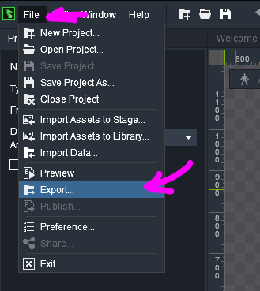
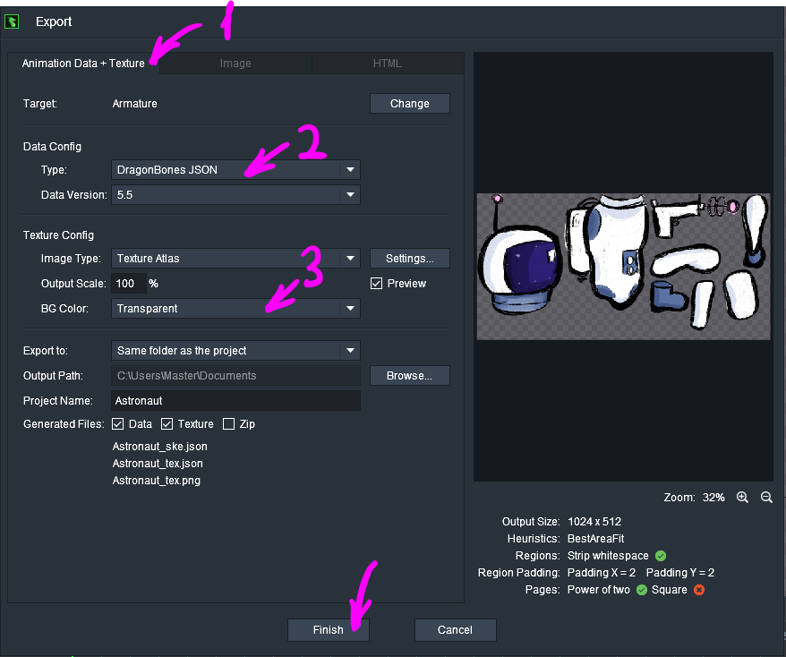

# Using Skeletal Animation in ct.js Projects

ct.js supports importing DragonBones animations. It was tested with DragonBones v5.6, but, as DragonBones has a good backweards compatibility, it should work back to v4.0, too. Dragonones is free to use and is available at [their official site](http://dragonbones.com/).

## Importing Skeletal Animation

To import animations with their textures, you should first open your DragonBones project. Make sure that your armature is called exactly as `Armature`.


Select File — Export…



You should then open the tab "Animation Data + Texture". Make sure that you export DragonBones **JSON** (not the binary format!) and that your background is transparent. You can set other parameters as you like. Then, smash the "Finish" button.



You will get three files in the output directory:

* `Animation_ske.json`;
* `Animation_tex.json`;
* `Animation_tex.png`.

We will need all the three files to be in the same location. Open ct.js, then the Graphics tab, and press the "Import" button. Locate the `Animation_ske.json` file and add it. Ct.js will then import all the three files into your project.

## Using Skeletal Animations

Skeletal animations are different from regular copies' sprites, and thus they will lack such features like collision detection, but they can be added to any regular copy.

To add a skeletal animation to a copy, write this to its On Create code:

```js
this.skel = ct.res.makeSkeleton('YourAnimationName');
this.skel.animation.play('DefaultAnimation');

this.addChild(this.skel);
this.graph = -1; // This will hide the copy's own sprite
```

These are some useful functions to manipulate the skeleton:

* `skel.animation.play('AnimationName');`
* `skel.animation.fadeIn('NewAnimation', durationInSecs);`
* `skel.armature.getSlot("SlotName").display = false;`

Example of adding dynamic skeletal animation with blends:

```js
/* Draw event */
var anim = this.skel.animation;

if (this.onGround) { // should be defined before
    if (this.hspeed === 0) {
        if (anim.lastAnimationName !== 'Stand') {
            anim.fadeIn('Stand', 0.2);
        }
    } else {
        if (anim.lastAnimationName !== 'Run') {
            anim.fadeIn('Run', 0.3);
        }
    }
} else {
    if (anim.lastAnimationName !== 'Jump') {
        anim.fadeIn('Jump', 0.2);
    }
}
```