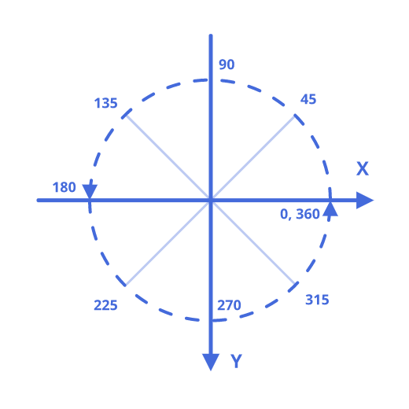
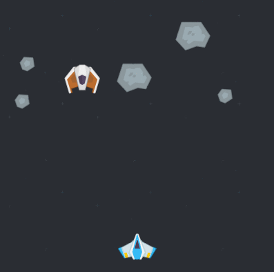

# Making Your First Game: Space Shooter

Let's make a small space shooting game with asteroids, lasers and hostile gunships! This tutorial will teach you how to import assets, handle user input, move things around and respond to collisions.

## Importing Graphic Assets 

Open ct.js and create a new project with a name "SpaceShooter".

(picture)

Next, [download an asset pack](http://www.kenney.nl/assets/space-shooter-redux) from Kenney's site. It is free to use and is great for prototyping, learning or just testing things out.

You can also use assets placed inside a `ct.js/docs/SpaceShooterAssets` folder.

These are all the assets we will need today:

(picture)

Now open the "Graphic" tab on the top of the ct.IDE window, and drag & drop these assets inside the ct.IDE window. You can also press an "Input" button to find them manually.

A card for each of the images will appear. Let's open the `PlayerShip` and configure it. We will see a yellow shape that defines its collision shape. For now, it covers too much empty space, especially above wings. To fix it, we should modify this collision shape in the left column.

Firstly, press a button "Image's center", so its axis is placed at the ship's center. Next, modify the four values above the "Fill" button. Each one defines how far should the rectangular shape extend from the image's center. I chose `12` to the top, `50` on sides and `32` to the bottom. 

(picture)

Press "Save" and move to the next graphic asset — "LaserRed". As with the ship, let's set its axis to center by clicking "Image's Center". Then, select a **Circle** collision shape right beneath this button. Now a yellow collision shape is drawn as a circle.

The next graphic asset, `Laser_Blue`, should be centered too, and since the collision shape should cover all the image, we can click the "Fill" button to automate it.

(picture)

The `EnemyShip`'s shape can be treated either as a **Circle** or as a **Rectangle**. Select the one you think is better.

(picture)

Both asteroids are definitely more circular by their shapes. Set their collision shape to **Circle**, and don't forget to set their axis to center.

(picture)

The background image may be left as is, because it won't collide with other things in the game.

## Making First Types and Laying Things Out

**Graphic assets** don't do much on their own, and in order to display them in game, we need to create **Types** with these assets. Types are used to create **Copies**, and the latter are the things that you place inside **Rooms**, that interact with each other and respond to your inputs.

Press the "Types" tab on top of the screen, and create a new Type for the player. After clicking the "Create" button, click on the big ghostly cat in the left column. It will show you all your graphic assets. Press the card with your ship. It should now appear in the left column of the editor.

(picture)

Now, change the Type's name to `PlayerShip` so we won't need to remember these numbers while coding.

(picture)

Create Types for all the other graphic assets but the background image. Background images don't move or interact with anything, and is often tiled, so it is not a Type. We will add it later in a **Room**.

(picture)

Let's place created Types somewhere on the map. To create this map, or Room, press the "Rooms" tab on top of the ct.IDE windows, and click an "Add new" button. Then, open the newly created room by clicking it.

(picture)

Here we will stop a bit to explain how to use the Room editor. Firstly, we can set up a Room's name and its viewport size. 

In ct.js, Rooms are infinite and can pan in any direction. You can place objects inside and outside the viewport.

Then we have Room events. It is a section that defines game logic specifically for this room. You can define UI or level scenario here.

Under this button we have a panel with Copies and Backgrounds. We pick a Copy from the according tab and place it to the map by clicking on a large area on the right. To disable adding new copies, select a ghostly cat on the left. You can pan the editor's view by dragging your mouse on the left side when nothing is selected. You can change zoom level by using buttons on the top, or by mouse wheel.

If you feel lost, press the "To center" button to return to (0, 0) coordinates.

You can set a grid by clicking on the button in the bottom right corner. Clicking it again will disable the grid.

Lastly, you can move all the copies in the room at once by clicking a button with a "move" icon in the top left corner.

For now, let's place a player's ship, a hostile one and a couple of asteroids.

(picture)

Then add a background. Click the "Backgrounds" tab and press "Add", then select our `BG`. It will appear as a tiled texture in the main view.

(picture)

Though backgrounds are always drawn before Copies of the same depth level (`0` by default), it is better to change their Depth level. Click on the zero on the left to the background's icon in the left column and input `-5`. By doing this, we tell the engine that this background is placed lower than other Copies and backgrounds. Depth represents a third coordinate axis that goes upwards, when X and Y go to the sides.


After that, save the project and click an export button. At this point, you will have a game project with immovable ships and asteroids.

(picture)

## Adding Player's Movement

Handling user's input is the most important task. In this section we will make the blue ship move when a player presses arrow keys.

In order to handle keyboard inputs, we need to enable keyboard module. Press the "Catmods" tab, find a `keyboard` module on the left, select it, and then push the big red button to enable it. Then add `random` and `place` modules, as we will need them later too.

(picture)

Open the "Types" tab on the top, next move to "Step" event.

> `Step` event occurs every frame before drawing, `Draw` happens after all the `Step` events in the room while drawing a new frame. `On create` happens when you spawn a new Copy, and  `On Destroy` occurs before the `Draw` event if a Copy is killed.

Write the following code:

```js
/**
 * Move the ship
 */

if (ct.keyboard.down['left']) { // Is the left arrow key pressed?
    this.x -= 8; // Move to the left by X axis
}
if (ct.keyboard.down['right']) { // Is the right arrow key pressed?
    this.x += 8; // Move to the right by X axis
}

/**
 * Check whether the shif fell off the viewport
 */
if (this.x < 0) { // Have the ship crossed the left border?
    this.x = 0; // Go back to the left border
}
if (this.x > ct.width) { // Have the ship crossed the right border?
    this.x = ct.width; // Go back to the right border
}

ct.types.move(this);
```

First, we move the ship if arrow keys were pressed, then we check whether its X coordinate fell off the viewport. Here `0` means the left side of the room and `ct.width` means the horizontal size of the viewport, which forms the right side.

All the methods starting with `ct.keyboard` come from the enabled module. You can read its documentation on the "Catmods" tab, "Reference" section.

> **On your own:** add a vertical movement to the player. Then, try to limit its movement so the ship can't fly above the middle of the viewport.

## Moving Hostiles and Asteroids

Enemies should move, too. For this tutorial, our hostile ship will move from top to bottom, and asteroids will fly in a random direction.

### Enemy ships

Open the "Types" tab, then click on the `EnemyShip`. Navigate to the `On Create` event and add this code:

```js
this.spd = 3;
this.dir = 270;
```

Here, we use built-in variables for moving. Manually editing coordinates is good for handling player's input, but for most tasks it is better to use these vars as they automate most of the things. Here, `this.spd` means the speed of the Copy, and `this.dir` refers to its direction.

> In ct.js, direction is measured in degrees, moving from the left side counter-clockwise. 0° means left, 90° means up, 180° is for right, and 270° points to the bottom.
>
> 

If we navigate to the `Step` event, we will see this little code:

```js
ct.types.move(this);
```

This line reads built-in variables and moves the Copy according to them. Without it, `this.spd` and `this.dir` will be meaningless.

There are more built-in variables, which you can find on the [`ct.types` page](ct.types.html).

We will modify the `Step` code so enemies will destroy themselves if they fall off the screen.

```js
ct.types.move(this);

if (this.y > ct.height + 80) {
    this.kill = true;
}
```

> **On your own:** what if enemy ships could move diagonally, zig-zagging?

### Asteroids

Asteroids will contain the same `Step` code, but their `dir` variable will be set at random.

Open the `Asteroid_Medium` in the "Types" tab, then write the code below in the `On Create` event. 

```js On Create event
this.spd = ct.random.range(1, 3);
this.dir = ct.random.range(270 - 30, 270 + 30);
```

The `Step` event will be the same as in `EnemyShip`.

```js Step event
ct.types.move(this);

if (this.y > ct.height + 80) {
    this.kill = true;
}
```

Do the same for another asteroid.

Save the project and click the "Play" button at the top. The hostile ship will slowly move to the bottom, while asteroids will move more chaotically. If you refresh the page, asteroids will move to a new direction.



## Projectiles & Collision

Now it is time to bring the guns.

Open the `PlayerShip`'s `Step` event, and add this code:

```js
if (ct.keyboard.pressed['space']) {
    ct.types.copy('Laser_Blue', this.x, this.y);
}
```

This is the first time we add new copies programmatically. Hooray!

> `ct.types.copy` is a very important function that spawns a new Copy in the current room. Firstly, we write an enquoted Type's name to copy. Then, we write coordinates at which we should create it, by horizontal and vertical axes accordingly. `this.x` means a horizontal location of current copy, and `this.y` means a vertical one.

With all the data combined, we make a laser bullet right under our ship. Bullets will spawn when the Space key is pressed.

Now let's move to the `Laser_Blue` itself. We will define its movement with default variables.

```js On Create code
this.spd = 18;
this.dir = 90;
```

Next, let's make that these laser bullets will disappear after they flew out the view. As they always fly to top, we may write a condition for the upper border only.

```js Step code
if (this.y < -40) {
    this.kill = true;
}

ct.types.move(this);
```

The next thing is handling collisions. It is better to write all the collision logic in enemy ships' and asteroids' code because they will respond differently, making no clutter in the bullet's code.

Go to the `EnemyShip`'s On Step code. Add the following code: 

``` js
var collided = ct.place.meet(this, this.x, this.y, 'Laser_Blue');
if (collided) {
    collided.kill = true;
    this.kill = true;
}
```

The method `ct.place.meet` checks whether a given copy collides with other copies of a certain type like if it was placed in the given coordinates. For this example, we need to check whether our current Copy (`this`) of enemy ships collides in its current position (`this.x, this.y`) with laser bullets (`'Laser_Blue'`). The method returns either a collided copy or `false`, so we need to check whether it returned a valid value.

> There are even more methods in the `ct.place` module. Open the 'Catmods' sections, and then click the `place` module on the left. Open the documentation by clicking the 'Reference' tab on the right.

If a ship collides with a laser bullet, then both the bullet and the ship should be destroyed.

Copy exactly the same code to `Asteroid_Medium`. We will need this code in `Asteroid_Big` too, but we will make it so that big asteroids break into two smaller ones:

``` js
var collided = ct.place.meet(this, this.x, this.y, 'Laser_Blue');
if (collided) {
    collided.kill = true;
    this.kill = true;
    ct.types.copy('Asteroid_Medium', this.x, this.y);
    ct.types.copy('Asteroid_Medium', this.x, this.y);
}
```

If you run the game, you will be able to destroy enemy ships and asteroids. Bigger asteroids should break into smaller ones.

### Enemy bullets

Enemy ships should be able to shoot, too. Add the following code to `EnemyShip`'s On Create code:

``` js
this.bulletTimer = 30;
```
With this, we will set up our timer so that the enemy ship will shoot with precise intervals. We will decrease the value of `this.bulletTimer` each step and reset it after shooting. `30` means that we will wait for 30 frames before shooting the first bullet.

Add this code to `On Step` section:

```js
this.bulletTimer--;
if (this.bulletTimer <= 0) {
    this.bulletTimer = 90;
    ct.types.copy('Laser_Red', this.x, this.y + 32);
}
```

`this.bulletTimer--;` means that we lower the value of `this.bulletTimer` by 1. It is the same code as `this.bulletTime -= 1;`. There is also a `++` operator which adds 1 to the given value.

When the timer variable goes down to zero, we wind it up by setting `this.bulletTimer` to a new number and create a red laser bullet. As you can see, by writing `this.y + 32` we spawn it a bit lower than the ship.

Let's write some code to red bullets. Add this code to `On Create` section of Laser_Red:

```js
this.spd = 8;
this.dir = 270;

this.transform = true;
this.tr = ct.random.deg();
```

By writing `this.transform = true;`, we tell the engine that this exact copy should render with some transformations. In this case, we will rotate the bullet each step, making a smooth animation.

`this.tr` stands for transform rotation. `ct.random.deg()` returns a random value between 0 and 360, which is handy while defining angular values.

> There is also `this.tx` and `this.ty`, which sets a copy's horizontal and vertical scale accordingly, and `this.ta` which manipulates its opacity (0 means fully transparent, 1 — fully opaque).

The code of On Step section will look as following:

``` js
if (this.y > ct.height + 40) {
    this.kill = true;
}

ct.types.move(this);

this.tr += 10;
```

`this.tr += 10;` means that we will rotate a Copy by 10 degrees at each step.

We will define logic for destroying player's ship later. For now, it's time to add enemy and asteroid generation during the playtime.

## Generating objects through time

Open the `Main` room in the Rooms section. Remove existing asteroids and enemies by right-clicking on them, or erase them with left mouse button while holding the `Ctrl` key.

Next, Press the `Room events` button on the left.

Rooms have all the same events like Copies have.

* `On Create` is called when you launch the game or move to this room programmatically;
* `Step` is called each frame, after Copies' `On Step`;
* `Draw` is called after drawing all the level. It is useful for drawing some basic UI;
* `On Leave` is called before moving to another room.

We will generate enemies in almost the same way as enemy ships generate their bullets. We will have a couple of timers and will place copies above the player's view.

To do this, setup two timers in the `On Create` code:

```js
this.asteroidTimer = 10;
this.enemyTimer = 90;
```

Then add this code to generate enemies through time:

```js
this.asteroidTimer--;
if (this.asteroidTimer <= 0) {
    this.asteroidTimer = ct.random.range(10, 100);
    ct.types.copy(ct.random.dice('Asteroid_Big', 'Asteroid_Medium'), ct.random(ct.width), -100);
}

this.enemyTimer--;
if (this.enemyTimer <= 0) {
    this.enemyTimer = ct.random.range(90, 200);
    ct.types.copy('EnemyShip', ct.random(ct.width), -100);
}
```

That's all what you need for generating asteroids and enemies!

> `ct.random.dice` returns one of the provided values. You can put any value here, including Numbers, Strings, complex objects. Here, there is a 50% chance that `'Asteroid_Big'` will be returned and a 50% chance that it will be `'Asteroid_Medium'`.

> `ct.random.range(a, b)` returns a random numerical value between `a` and `b`.

> `ct.random(b)` is the same as `ct.random.range(0, b)`.

## Lives, score and GUI

Let's add score counting to the game and player ship's reaction to hostiles.

### Adding and drawing score

Score is a numerical variable that is stored globally. In our case it is better to place it inside the room. Open the `Main` room, and then click on 'Room events' button. Add this code to the `On Create` section:

```js
this.score = 0;
```

Add this line to the `Draw` section:

```js
ct.draw.text(this.score, 30, 30);
```

This will draw the number of score points to the player's view.

Then move to `EnemyShip`'s `On Step` code, and add `ct.room.score += 100;` to a place where a ship is destroyed after colliding with a bullet, so the whole code looks like this:

```js
ct.types.move(this);

if (this.y > ct.height + 80) {
    this.kill = true;
}

var collided = ct.place.meet(this, this.x, this.y, 'Laser_Blue');
if (collided) {
    collided.kill = true;
    this.kill = true;
    ct.room.score += 100;
}

this.bulletTimer--;
if (this.bulletTimer <= 0) {
    this.bulletTimer = 90;
    ct.types.copy('Laser_Red', this.x, this.y + 32);
}
```

> `ct.room` points to the current room object.

Do the same to asteroids, too. Change the number of given score points as you wish.

If you launch the game, you may notice a small black number in the top-left corner which changes as asteroids and enemy ships get destroyed. But this doesn't look nice, so it is a good time to make some styling.

Text, shapes, lines, polygons can be drawn with pre-defined styles that declare fill color, line style, font settings, shadow. They are created in the `Styles` section in the top bar. Create one by clicking on the `Create` button. You will see a style editor, which has a left bar with tabs for setting properties and a preview image on the right.

Each tab should be activated in order to affect the result. Styles can be combined by applying ones on top of others, so every tab is optional.

Let's make the font bigger and bolder. Change its size and set its weight to 800. Then align it to be drawn from a top left corner. Your image might look as follows:

(picture)

Click the `Fill` tab, activate it, and then select the "Diffuse" fill type. Select an appropriate color; I chose something similar to the player's ship's colors.

(picture)

Add shadow, or border, or both! Then save the changes by clicking the "Apply" button in the bottom-left corner.

Name the created style as `ScoreText`. You can rename it by right-clicking it in the list view.

Now let's return to the room's events. Open the `Draw` tab, and modify the code so it looks like this:

```js
ct.styles.set('ScoreText');
ct.draw.text('Score: ' + this.score, 30, 30);
ct.styles.reset();
```

> `ct.styles.set('Style');` applies the given style to the current drawing settings.

> `ct.styles.reset();` changes current drawing settings back to default ones (no border or shadows, small black text). It is important to execute this method after you finish drawing with styles; otherwise, any shadows will leak to every Copy in the room, making the game lag, and other styles may look not as expected.

If you launch the game, the score will be drawn in your created style. Hooray!

### Drawing and managing lives

Managing lives is similar to managing score points. Add line `this.lives = 3;` to the room's `On Create` code. Then modify the `Draw` code so that it draws the number of lives, too:

```js
ct.styles.set('ScoreText');
ct.draw.text('Score: ' + this.score, 30, 30);
ct.draw.text('Lives: ' + this.lives, ct.width - 200, 30);
ct.styles.reset();
```

> **On your own:** create a new style and apply it to the 'Lives' label.

Then we should add logic so that player's ship removes one life on collision. We could use `ct.place.meet` as we used it in asteroids' and enemies' code, but let's group them into one _collision group_. It will allow us to write less code and won't require any changes if we add more enemies, missiles or asteroids of different size.

To add copies to a collision group, we should add this line of code to all the needed types:

```js
this.ctype = 'Hostile';
```

Add this line to `On Create` code of asteroids, enemy ship and red lasers.

Now add this code to the player ship's `On Step` code:

```js
var hostile = ct.place.occupied(this, this.x, this.y, 'Hostile');
if (hostile) {
    hostile.kill = true;
    ct.room.lives --;
    if (ct.room.lives <= 0) {
        this.kill = true;
        setTimeout(function() {
            ct.rooms.switch('Main');
        }, 1000);
    }
}
```

`ct.place.occupied` is similar to `ct.place.meet` which we were using before, but works with _collision groups_, not types.

`ct.rooms.switch` unloads the current room and loads a new one. By pointing to the same room as we were playing, we restart it.

`setTimeout` is a standard browser's function that executes a function after a given number of milliseconds. Here we wait one second (1000 milliseconds) and then restart the room.

> `setTimeout` may seem like a better way to work with delayed events than writing timers. The difference is that timers exist while its owner does, but `setTimeout` will happen in any circumstances, even if the copy that called it was removed from a room (actually, there _is_ a way to cancel a `setTimeout`, but it isn't that handy when working with different copies).
>
> In our case, we want the room to be restarted though there aren't any player ships on the screen, so we use `setTimeout`. We use timers for shooting and spawning enemies because we don't want bullets to randomly appear after enemies were destroyed.

Save your project and test it out. Now you have a small, but fully working space shooter! There is a lot of ways to improve this game further:

* tweak existing values, like enemy speed or score points for a better gameplay;
* add more enemies;
* improve shooting with timers so that you can just hold your spacebar, not smash it;
* add bonuses and different weapons;
* design a main menu and a victory screen;
* add sounds;
* create bosses and companions.

That's my result of improving this project furthermore: [Catsteroids](https://comigo.itch.io/catsteroids).

You can also start a new project if you're not into space shooters :D