# Making Games: Platformer

In this tutorial, we will create a small platformer with diamonds, checkpoints, moving platforms, and traps! You will learn how to detect collisions, use them to create a side-view movement, and how to manipulate sprites and move the player between levels.

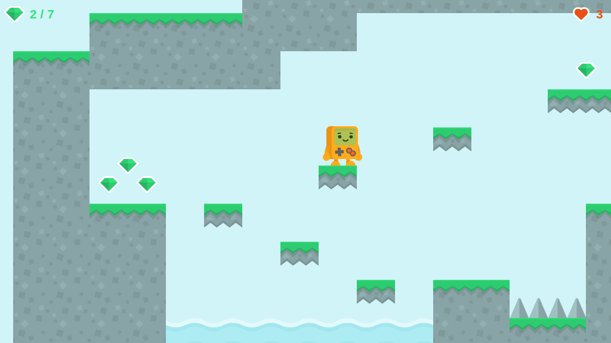

## Creating a Project

Open ct.js and create a new project called "Platformer".

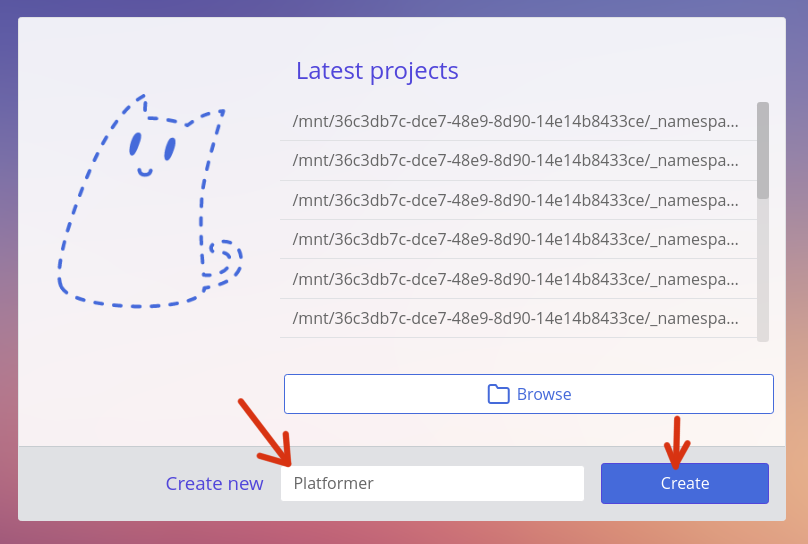

## Importing Graphics Assets

We will need some assets from the [simplified platformer pack by Kenny](https://www.kenney.nl/assets/simplified-platformer-pack). You can find the needed assets with proper names in the `ctjs/examples/Platformer_assets/` folder.

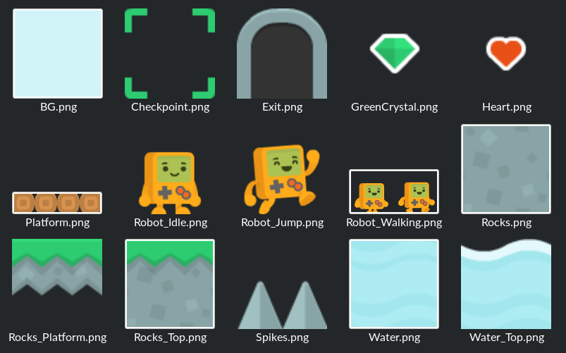

Open the "Graphics" tab, press the "Import" button, navigate to the `ctjs/examples/Platformer_assets/` folder and select all the images there. They will appear in the graphics panel.

The first thing that we can notice is that the Robot_Walking animation is counted on as one image, not as two separate frames. Click on the `Robot_Walking` asset.

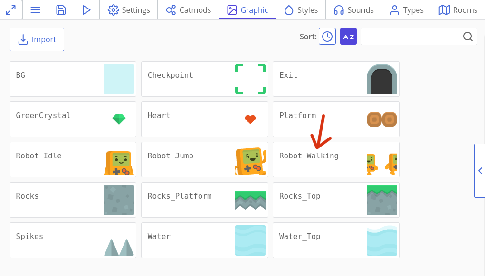

The image is a small horizontal stripe. It has one row and two columns. We can tell ct.js to divide the image in this way by setting `Columns` and `Rows` fields and then calibrating the `Width` field.

The whole image is 192 pixels wide so one frame will be 192 : 2 = 96 pixels wide. The robot's frames should now be outlined with two rectangles.

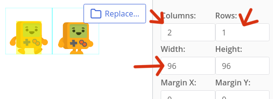

Now let's edit its collision mask. It determines which areas of an image are counted as solid and which are not, and is displayed as a yellow rectangle over the sprite.

Firstly, shift its axis so it is placed at the bottom middle point.

::: tip Explanation
As we have a 96x96 pixels image, we need 48 pixels on the horizontal axis and 96 at a vertical one. Pixels are measured from the top-left corner, and the first value of a point is usually its horizontal component, or its X value, and the second is referred to as an Y component.
:::

The robot has a nice rectangular shape so it will be wiser to mark it up as a rectangle. Make sure you have a rectangular shape selected, click the 'Fill' button and calibrate the offsets so the robot's body is covered with a yellow rectangle.

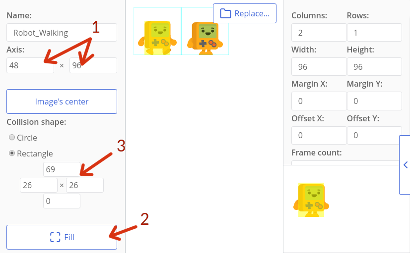

You can cover both body and hands, or select the body only.

Click the "Save" button in the bottom-left corner.

We now need to set collision masks for `Robot_Idle` and `Robot_Jump` too. Make sure that you shift the axis to 48x96 and calibrate collision masks for both of them.

::: tip
It is also good to make collision offsets same for each of the three sprites, so the robot doesn't clip into the surface when switching its animations and suddenly getting bigger.
:::

Now let's set the collision shapes of our crystals and heart bonuses. These can be defined as circles. Open the `GreenCrystal`, set its collision shape as a "Circle", then click a button called "Image's center" so the axis automatically snaps to needed values, and calibrate the collision shape's radius.

Do the same for the `Heart` asset.


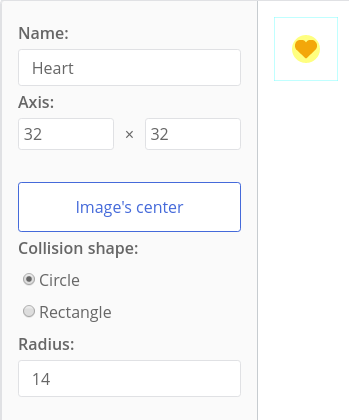

The last asset we need to modify is the `Spikes`. We don't need to shift its axis, because it will appear misaligned on the map in this way, but we still need to set its collision shape. Set its top offset to a negative value so the top part of the image is not filled with yellow.

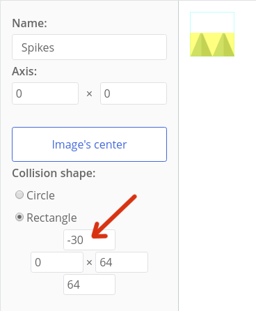

Save your asset. If you look into other graphics assets, you will see that they all have a rectangular shape that fills the whole image. That fits for all other images so we will leave them as is.

## Creating a Robot Character and Ground

Open the "Types" tab and create a new type. Call it "Robot", set its sprite to `Robot_Idle`, and save it.


::: tip
Types are like templates, from which copies are created. We fill our levels (also often named as rooms) with copies, and they are the things that interact with each other on the screen, but each copy was created from a certain type.
:::

Create additional types in the same way:

* Rocks;
* Rocks_Top;
* Rocks_Platform.

### Adding a Room

Click on the "Rooms" tab at the top and create a new room. Set its name to "Level_01". Set view's size to 1024x576.

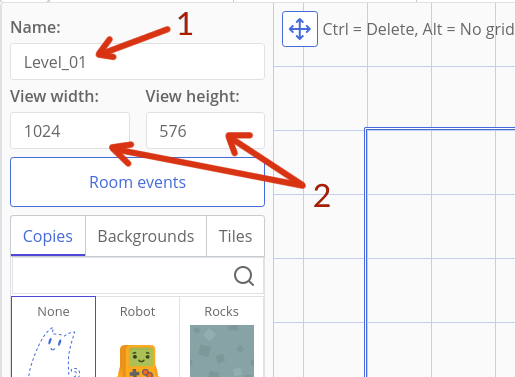

Then draw a level by clicking on a type on the left and then placing it with your mouse in the big area on the right. Hold `Shift` to add multiple copies at once. Don't forget about the robot!

You can expand your level to any side, and copies don't need to be inside the blue frame. This frame, which is manipulated by view's size, just sets the initially visible part of your level.

I drew this. It is hard to get stuck here as a player, but it teaches how to jump. We can also add crystals on the rock platform later, and some secret in a window under the final hill.

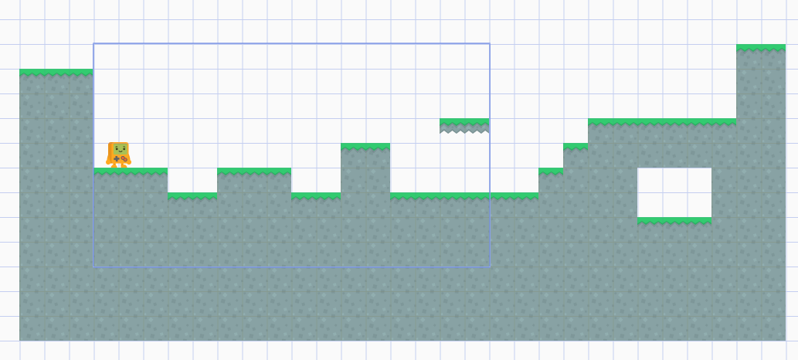

Now let's add a background. Click the "Backgrounds" tab on the left, press "Add", and select the `BG` asset. Now click on the 0 near our new background and change its depth to `-10`. Thus we tell the engine that the background should be drawn 10 layers below the default 0 layer.

If we save the project now and click the "Play" button at the top, we will be able to see a small portion of our level drawn in a debugger window. Nothing is movable yet, but it's still a good beginning!

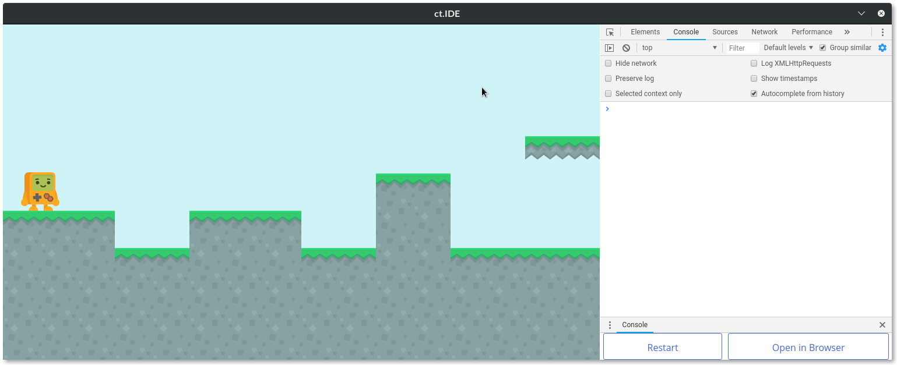

### Adding Modules for Keyboard and Collisions

We will need to listen to keyboard events and to detect collisions between the Robot and ground. For such superpowers, we will need Catmods! Click on the "Catmods" tab and select the `keyboard` on the left. Then press the big red knob to enable this module. Do the same with the `place` module.

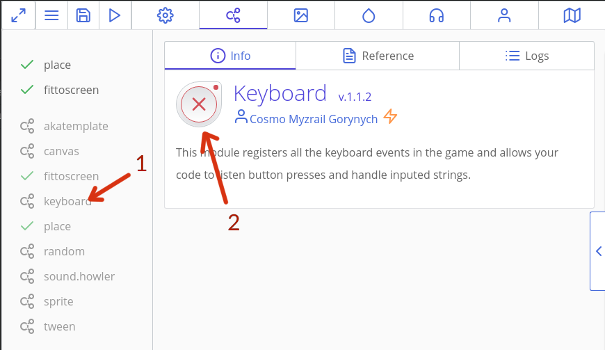

::: tip PRO TIP ✨
Enable the catmod called `fittoscreen`, then go to its settings tab and enable the option called "Just scale, no canvas resize" for an automagical full-screen view.
:::

Each module has its own documentation on the "Reference" tab. We will highlight some of its parts later.

### Coding Collision Detection and Movement

Now, move to the "Types" tab at the top of the screen and open the `Rocks` type. The "On Create" tab should be selected by default; write this line to its code:

```js
this.ctype = 'Solid';
```

This will tell the `ct.place` catmod that this exact type belongs to a special collision group called "Solid". The name of this group can be of any value, and the number of such groups is unlimited. For now, one group will be enough.

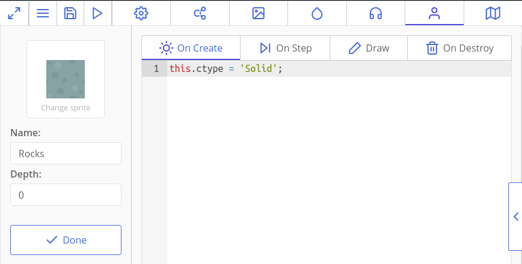

Add the same line to `Rocks_Top` and `Rocks_Platform`.

Now open the `Robot` type. If you completed the "Space Shooter" tutorial before, you may recall that movement is made using either direct manipulation of a copy's parameters or by using built-in variables like `this.spd` or `this.dir`. The truth is that the latter never worked, even outside ct.js! We will need to write something more complicated. Be prepared! 😃

The idea of a side-view movement is that we will have a value on which we would like to move to, and then we will check whether we are colliding with something or not, pixel-by-pixel.

Let's set up some variables on the "On Create" tab:

```js
this.speed = 8; // Max horizontal speed
this.jumpSpeed = -10;
this.gravity = 1;

this.hspeed = 0; // Horizontal speed
this.vspeed = 0; // Vertical speed
```

::: tip
`this` is a copy that is executing the written code. In this case, it is a `Robot` copy.
:::

Now move to the "On Step" tab and add this code:

```js
if (ct.keyboard.down['A']) {
    // If the A key on keyboard is down, then move to left
    this.hspeed = -this.speed;
} else if (ct.keyboard.down['D']) {
    // If the D key on keyboard is down, then move to right
    this.hspeed = this.speed;
} else {
    // Don't move horizontally if no input
    this.hspeed = 0;
}

// If there is ground underneath the Robot…
if (ct.place.occupied(this, this.x, this.y + 1, 'Solid')) {
    // …and the W key or the spacebar is down…
    if (ct.keyboard.down['W'] || ct.keyboard.down['space']) {
        // …then jump!
        this.vspeed = this.jumpSpeed;
    } else {
        // Reset our vspeed. We don't want to be buried underground!
        this.vspeed = 0;
    }
} else {
    // If there is no ground  
    this.vspeed += this.gravity;
}
```

::: tip
"On Step" code is executed each frame for each copy. Movement and other game logic usually go here.
:::

::: tip
`ct.keyboart.down['key']` checks whether a given `key` is currently held down. Note the square brackets here! There are also `ct.keyboard.pressed['key']` and `ct.keyboard.released['key']`.

`ct.place.occupied(copy, x, y, group)` checks whether a given copy has any collisions in given coordinates with a specific group. You can omit the group if you don't need it. This method returns either `false` (no collision) or a copy which was the first to collide with.
:::

This will set variables `hspeed` and `vspeed`, but they won't do anything as is. Add more code to actually move the Robot around:

```js
// Move by horizontal axis, pixel by pixel
for (var i = 0; i < Math.abs(this.hspeed); i++) {
    if (ct.place.free(this, this.x + Math.sign(this.hspeed), this.y, 'Solid')) {
        this.x += Math.sign(this.hspeed);
    } else {
        break;
    }
}
// Do the same for vertical speed
for (var i = 0; i < Math.abs(this.vspeed); i++) {
    if (ct.place.free(this, this.x, this.y + Math.sign(this.vspeed), 'Solid')) {
        this.y += Math.sign(this.vspeed);
    } else {
        break;
    }
}
```

::: tip
`ct.place.free` is an opposite equivalent of `ct.place.occupied`. It has the same parameters and returns either `true` or `false`.

`Math.abs` returns the absolute value of a given number, meaning that negative numbers will become positive. `Math.sign` returns -1 if the given value is negative, 1 if it is positive, and 0 if it is 0. Combined together, they create a `for` loop which works in both directions and checks collisions pixel by pixel.
:::

We can now move our Robot around!

::: warning
Your character may ignore holes which are one grid cell wide. Test it. If it occurs, you need to make the Robot's collision shapes a bit slimmer.
:::

::: tip On your own!
Modify the code so that the player can control it with arrows, too.
:::

### Making Camera Follow the Robot

If we launch the game now, we will be able to move the Robot around. There is an issue, though: the camera isn't moving!

It is not a hard issue, though. If we dig into the ct.js docs and read the ct.rooms section, we will find that there are properties `ct.rooms.current.follow`, `ct.rooms.current.borderx` and `ct.rooms.current.bordery` exactly for following a copy.

Open the `Robot` type and its "On Create" Code. Add this code to the end:

```js
ct.room.follow = this;
ct.room.borderx = 450;
ct.room.bordery = 200;
```

The camera will now follow the Robot.

## Adding Traps and Checkpoints

We will now add deadly traps and water moats, and checkpoints so the player restarts at them and not at the beginning of the level.

Create new types for `Water`, `Water_Top`, `Spikes` and `Checkpoint` assets.

Create a new room and call it `Level_02`. Set its size to 1024x576 and add a background. Create a dangerous level with spikes and lakes.

Place checkpoint boxes before and/or after hazardous places. Don't be afraid to put a lot of them, as punishing a player for mistakes is never a good idea! 😉

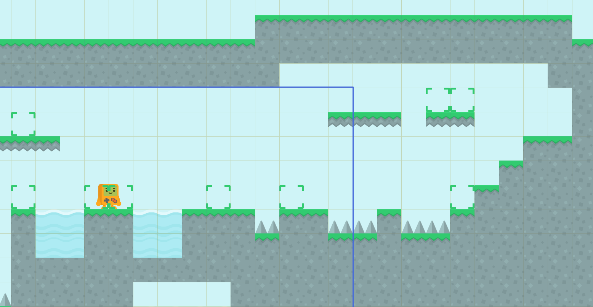

Here the supposed level's end is placed on the top middle platform. I also placed some platforms outside the screenshot for gathering future crystals.

Now let's move to the `Checkpoint`'s type and edit its "On Step" code.

We will check for collision with the Robot, and when it happens, we will store a rescue point inside the Robot's copy. Remove the line `ct.types.move(this);` and add this code:

```js
var robot = ct.place.meet(this, this.x, this.y, 'Robot');
if (robot) {
    robot.savedX = this.x + 32;
    robot.savedY = this.y + 32;
}
```

::: tip
The line `ct.types.move(this);` is responsible for moving copies that use standard ct variables around. In this case, the checkpoint shouldn't move at all. 😉

`ct.place.meet` is almost the same as ct.place.occupied, but it checks against copies' types, not their collision group. This is also the fastest method if compared to `ct.place.free` and `ct.place.occupied`.
:::

Here we also shift the stored point by 32x32 pixels, because the checkpoint's axis is placed in its top-left corner, but the Robot's axis is placed at the middle bottom point. Because of that, the Robot would respawn a bit left and above the desired central point.

Go to the "Draw" tab and erase the line `ct.draw(this);`. This will make checkpoints invisible during the gameplay.

Now go to the `Spikes` type and mark them as a "Deadly" collision:

```js
this.ctype = 'Deadly';
```

Do the same with `Water` and `Water_Top`.

Now open the `Robot` type again, and add this code to the top of its `On Step` code:

```js
if (ct.place.occupied(this, this.x, this.y, 'Deadly')) {
    this.x = this.savedX;
    this.y = this.savedY;
    this.hspeed = 0;
    this.vspeed = 0;
    return;
}
```

::: tip
Here, the `return;` statement stops the execution of a function. We won't need movement and other checks if we need to respawn the Robot at some other position.
:::

We should also write this code to "On Create" code so that respawn point will be at creation location by default, in case something ever goes wrong:

```js
this.savedX = this.x;
this.savedY = this.y;
```

To test a specific room, open the "Rooms" tab at the top, then right-click the desired room and press "Set as starting room".

## Transforming and Animating the Robot

At this point, it will be wise to add little animations to our robot. As you remember, we have three different assets called `Robot_Idle`, `Robot_Jump`, and `Robot_Walking`.

Add this code to `Robot`'s "On Create" code:

```js
// Enable image transforms on this copy
this.transform = true;
// Play 8 frames per second
this.imgspd = 8 / ct.speed;
```

Open the `Robot`'s "On Step" code and modify the moving section so it changes the drawn graphics asset depending on user inputs and the robot's position in space:

```js{4,5,6,10,11,12,16,31,32}
if (ct.keyboard.down['A']) {
    // If the A key on keyboard is down, then move to left
    this.hspeed = -this.speed;
    // Set the walking animation and transform the robot to the left
    this.graph = 'Robot_Walking';
    this.tx = -1;
} else if (ct.keyboard.down['D']) {
    // If the D key on keyboard is down, then move to right
    this.hspeed = this.speed;
    // Set the walking animation and transform the robot to the right
    this.graph = 'Robot_Walking';
    this.tx = 1;
} else {
    // Don't move horizontally if no input
    this.hspeed = 0;
    this.graph = 'Robot_Idle';
}

// If there is ground underneath the Robot…
if (ct.place.occupied(this, this.x, this.y + 1, 'Solid')) {
    // …and the W key or the spacebar is down…
    if (ct.keyboard.down['W'] || ct.keyboard.down['space']) {
        // …then jump!
        this.vspeed = this.jumpSpeed;
    } else {
        // Reset our vspeed. We don't want to be buried underground!
        this.vspeed = 0;
    }
} else {
    // If there is no ground  
    this.vspeed += this.gravity;
    // Set jumping animation!
    this.graph = 'Robot_Jump';
}
```

As out vertical movement isn't dependant on the horizontal movement, the animation is overridden to the jumping state if there is no ground under the robot.

The robot will now flip to the current direction and change its graphics asset depending on movement. Look at that boy!

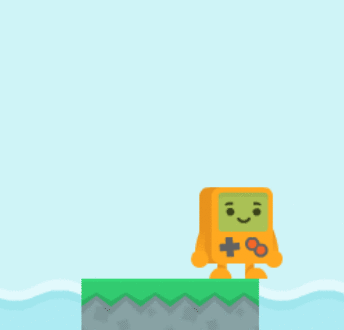

## Adding level transitions

Here's the idea:

* Each room will store a name of the next room as a variable.
* There will be level exits that will collide with the Robot.
* When they collide, the exit will read the room's variable and switch to the next room.

Create a new type and call it an `Exit`. Set its graphics asset. Then open the "On Step" tab and write this code:

```js
// Are there next rooms defined?
if (ct.room.nextRoom) {
    // Do we collide with the Robot?
    if (ct.place.meet(this, this.x, this.y, 'Robot')) {
        // Switch to the next room
        ct.rooms.switch(ct.room.nextRoom);
    }
}
```

::: tip
Here `ct.room` points to the current room. `ct.rooms.switch` exits the current room and opens another room with a given name.
:::

Now go to the "Rooms" tab at the top, open the `Level_01`, click the button called "Room's events" and write the following to its "On Create" code:

```js
this.nextRoom = 'Level_02';
```

Place an exit to the room.

Now save the room, mark the `Level_01` as a starting room by right-clicking it and test whether there is a transition.

::: tip On your own!
Create additional exits leading to secret sublevels and back. Get [more graphics assets from here](https://www.kenney.nl/assets/simplified-platformer-pack), if you need such.
:::

## Collectibles: Counting and Drawing

### Adding Crystals

Create a new type called `GreenCrystal` and set its sprite. Write this code to its "On Step" event:

```js
if (ct.place.meet(this, this.x, this.y, 'Robot')) {
    ct.room.crystals ++;
    this.kill = true;
}
```

::: tip
`this.kill = true;` tells that the current copy should be removed from the current room. It will happen after any "On Step" events but before the "Draw" event.
:::

As you may already guess, the number of gathered crystals will be stored in the room.

But if we continue to add more features to room-specific codes, we will soon fail into buggy traps of forgetting to copy-paste some snippets. Anyway, it will be a tedious job to do that to the third room. (And we *will* have a third room!)

So we need to create reusable functions now. This may look strange, but it is actually not that hard.

Go to the "Settings" tab on the top of the screen, and press the "Add a New Script" button at the bottom-right corner:

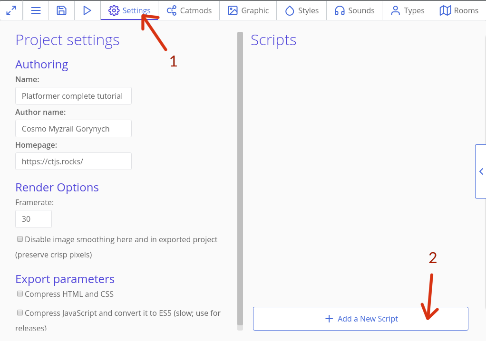

Call a new script as `inGameRoomStart`. Write this code:

```js
var inGameRoomStart = function (room) {
    room.crystals = 0;
    room.crystalsTotal = ct.types.list['GreenCrystal'].length;
};
```

::: tip
`ct.types.list['TypeName']` returns an array of all the copies of the given type in the room. `length` returns the size of an array.
:::

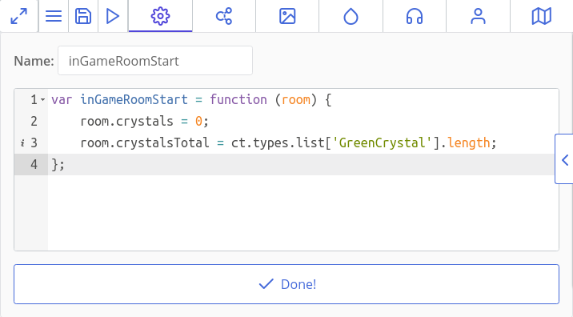

Now go to each room's "On Create" code and add this line:

```js
inGameRoomStart(this);
```

Hmmm… it looks familiar! Like `ct.draw(this);` or `ct.place.free(this, this.x, this.y)`! That's actually how most of the ct.js methods work: you have a method, and you tell this method to do something with that copy or that room.

When `inGameRoomStart(this);` is called it will set `crystals` and `crystalsTotal` parameters by itself, without the need to write such code directly to a room.

So that's how we gather and count the crystals, but we also need to draw their count and do it with *style*. ✨

Gladly, there is a tool for designing nifty styles inside the ct.js. Open the "Styles" tab at the top of the screen and create a new style. Call it as a `CrystalCounter`.

Activate the "Font" section and set the font size to 20 and its weight to 900. Align it to the middle left.

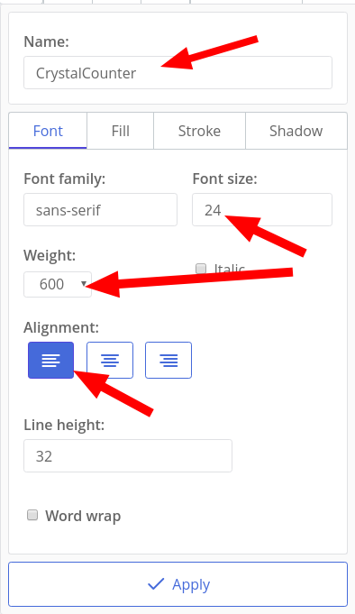

Then open the "Fill" tab, activate it and set its fill color to green. I chose `#33E27D` as it is the main color of the crystal. There are also darker shades like `#2ECC71` and `#28B463`.

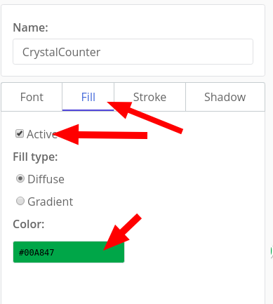

Now save the style and open the "Settings" tab. We will need to create another reusable function. Let's call it `inGameRoomOnDraw`. Write the following:

```js
var inGameRoomOnDraw = function(room) {
    ct.draw.image('GreenCrystal', 0, room.x + 24, room.y + 24);
    ct.styles.set('CrystalCounter');
    ct.draw.text(room.crystals + ' / ' + room.crystalsTotal, room.x + 50, room.y + 24);
    ct.styles.reset();
};
```

Now save the script and add a line `inGameRoomOnDraw(this);` to the "Draw" event of both rooms.

We will now have a crystal counter at the top-left corner of our screen.

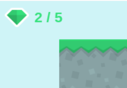

### Adding Lives and Heart Bonuses

This is mostly similar to gathering crystals, though there are some changes:

* We start with 3 lives.
* We will have no more than 3 lives at once.
* If we lost the last life, the level restarts.

::: tip On your own!
Try making it all by yourself! If you get lost, just look for instructions below. Now, stop scrolling! 😃
:::

Create a new type called `Heart` and set a corresponding sprite. Add this code to its "On Step" tab:

```js
if (ct.place.meet(this, this.x, this.y, 'Robot')) {
    if (ct.room.lives < 3) {
        ct.room.lives++;
        this.kill = true;
    }
}
```

Then go to the "Settings" tab and modify the `inGameRoomStart` script:

```diff
var inGameRoomStart = function (room) {
    room.crystals = 0;
    room.crystalsTotal = ct.types.list['GreenCrystal'].length;
+    room.lives = 3;
};
```

Don't forget to place actual heart bonuses on your levels!

We will also need a style for a counter. The process is the same, and the suitable color is `#E85017`. We can even duplicate the existing style! Let's call this style a HeartCounter.

Then edit the `inGameRoomOnDraw` script in the "Settings" tab, adding a code for drawing the lives portion:

```js
var inGameRoomOnDraw = function(room) {
    // Draw a crystal counter
    ct.draw.image('GreenCrystal', 0, room.x + 24, room.y + 24);
    ct.styles.set('CrystalCounter');
    ct.draw.text(room.crystals + ' / ' + room.crystalsTotal, room.x + 50, room.y + 24);
    ct.styles.reset();
    
    // Draw lives
    ct.draw.image('Heart', 0, room.x + room.width - 50, room.y + 24);
    ct.styles.set('HeartCounter');
    ct.draw.text(room.lives , room.x + room.width - 25, room.y + 24);
    ct.styles.reset();
};
```

Note how we use the property `room.width` to draw an image and a label on the right side of the screen.

Now modify the respawn code of the `Robot` so it loses one heart at each respawn:

```js
if (ct.place.occupied(this, this.x, this.y, 'Deadly')) {
    this.x = this.savedX;
    this.y = this.savedY;
    this.hspeed = 0;
    this.vspeed = 0;
    // remove one life
    ct.room.lives --;
    if (ct.room.lives <= 0) {
        // Restart a room: switch to the room of its own name
        ct.rooms.switch(ct.room.name);
    }
    return;
}
```

That's it! Time for little testing.

## Adding moving platforms

Create a new type called `Platform` and select its corresponding sprite. Create a new level called `Level_03` that features wide moats or long traps with platforms that move you around.

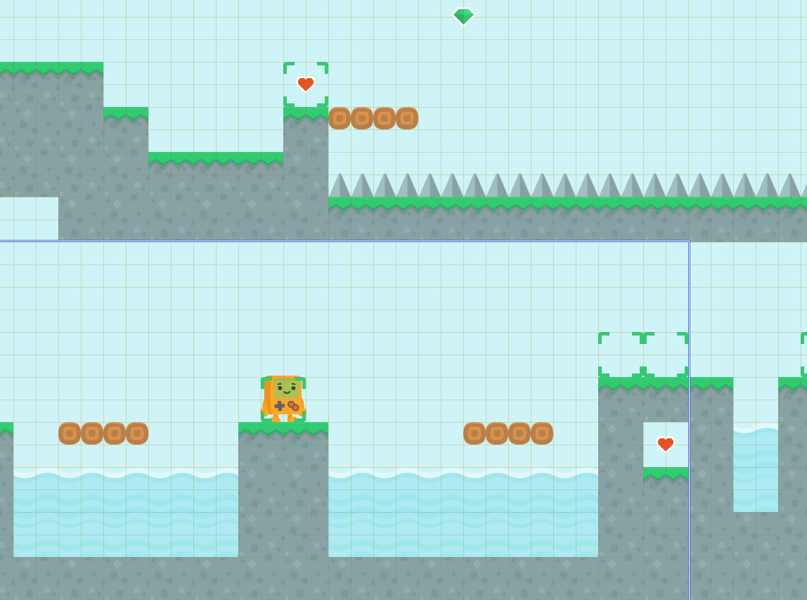

The moving platforms will act in this way:

* They move horizontally, starting moving, say, to the right.
* If a platform detects that it will touch a `Solid` object in the next frame, it flips their direction.
* Platforms move the player if it appears to be right above the platform.

Let's open a `Platform`'s type and initialize its speed and collision group:

```js
this.speed = 4;
this.ctype = 'Solid';
```

Then, add some code to the "On Step" tab to move our Robot:

```js
var robot = ct.place.meet(this, this.x, this.y - 1, 'Robot');
if (robot) {
    robot.x += this.speed;
}
```

And the movement logic:
```js
this.x += this.speed;
if (ct.place.occupied(this, this.x + this.speed, this.y, 'Solid')) {
    // Flip the speed direction
    this.speed *= -1;
}
```

Looks simple! Maybe even too simple. And here is the issue: if the Robot touches the left or right side of a platform, it gets stuck forever! We need to make platforms solid only when they don't overlap.

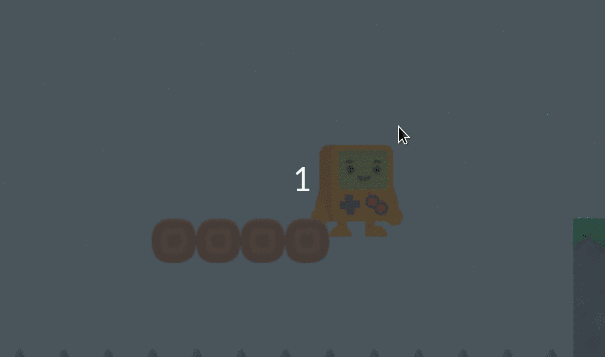

Here is a better code:

```js
var robot = ct.place.meet(this, this.x, this.y, 'Robot');
if (robot) {
    this.ctype = undefined;
} else {
    this.ctype = 'Solid';
    robot = ct.place.meet(this, this.x, this.y - 1, 'Robot');
    if (robot) {
        robot.x += this.speed;
    }
}

this.x += this.speed;
if (ct.place.occupied(this, this.x + this.speed, this.y, 'Solid')) {
    // Flip the speed direction
    this.speed *= -1;
}
```

::: tip On your own!
Add vertically moving platforms! And make sure they don't squash the Robot. 😉 
:::

## That's it!

Whew! That was quite a long tutorial. Still, there is much room for improvement.

Here is how you can make this game better:

* Add enemies and deadly moving chainsaws! You can get sprites of them and much more [here](https://www.kenney.nl/assets/platformer-art-deluxe).
* Create a story and tell it through NPCs, notes on wooden plates, or just through subtitles!
* Make the respawn process better. Make sure the Robot doesn't fall into traps after respawning. This can be done by blocking a player's input for a half of a second, or just by making checkpoint areas safer.
* Add sounds! Nothing makes a game more alive than some good-quality SFX.
* Make sure that the Robot is respawned if it occasionally falls out of a level.
* Just add more levels. 😉 Decorate them with plants, create worlds of different colors.

::: tip A side note
Look how new features in your code gradually appear in your levels! This is a good way to introduce new things to a player, too. Afford them one new concept at a time, but preserve previous ones with escalating difficulty. *That was a pro-tip on level design by Comigo* 😎
:::

**Happy coding!**  
Comigo